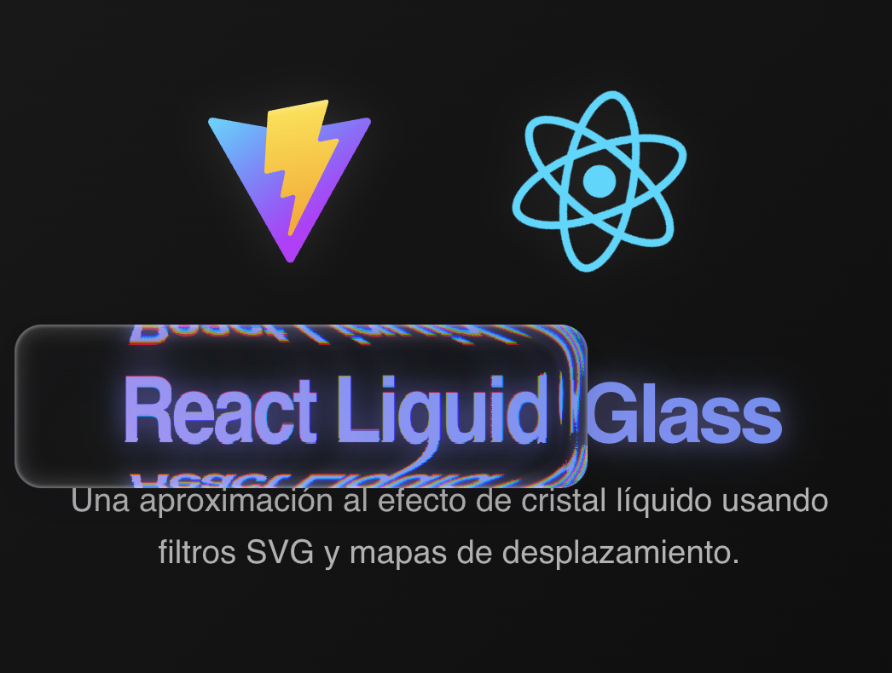
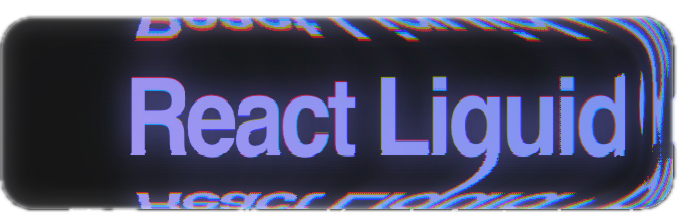

# Liquid SVG Glass



<div align="center">




*A sophisticated React component library for creating realistic liquid glass effects using SVG displacement mapping and chromatic aberration*

[📱 Live Demo](https://your-demo-url.com) • [📚 Documentation](https://your-docs-url.com) • [🎨 Storybook](https://your-storybook-url.com)

</div>

## 🎯 What is Liquid Glass Effect?

The Liquid Glass Effect is a **real-time pixel distortion system** that simulates viewing content through liquid crystal. It combines SVG displacement mapping with chromatic aberration to create convincing optical refraction effects using only standard web technologies.

### Key Concept

```css
.glass-element {
  backdrop-filter: url(#custom-svg-filter);
  /* ☝️ This applies an SVG filter to the content BEHIND the element */
}
```

> **Key insight**: Unlike `filter` which affects the element itself, `backdrop-filter` distorts what you see **through** the element, like applying a real-time Photoshop shader to the background.

## 🏗️ Architecture

This monorepo contains:

- **[@liquid-svg-glass/core](./packages/core)** - Framework-agnostic utilities and types
- **[@liquid-svg-glass/react](./packages/react)** - React components and hooks
- **[showcase](./apps/showcase)** - Demo application with interactive examples

## 🚀 Quick Start

### Installation

```bash
# Install both packages
npm install @liquid-svg-glass/core @liquid-svg-glass/react

# Or with yarn
yarn add @liquid-svg-glass/core @liquid-svg-glass/react

# Or with bun
bun add @liquid-svg-glass/core @liquid-svg-glass/react
```

### Basic Usage

```tsx
import { GlassEffect } from '@liquid-svg-glass/react';

function App() {
  return (
    <GlassEffect preset="dock" draggable={true}>
      <div>Your content here</div>
    </GlassEffect>
  );
}
```

### Available Presets

```tsx
// Dock-style glass effect
<GlassEffect preset="dock" />

// Pill-shaped glass
<GlassEffect preset="pill" />

// Bubble effect
<GlassEffect preset="bubble" />

// Fully customizable
<GlassEffect preset="free" />
```

## 🎨 Customization

### Granular Control

```tsx
<GlassEffect
  preset="free"
  width={500}
  height={200}
  scale={-180}
  r={60} g={70} b={50}  // Chromatic aberration
  blur={15}
  frost={0.2}
  draggable={true}
  initialPosition={{ x: 100, y: 100 }}
>
  <div>Custom glass effect</div>
</GlassEffect>
```

### Configuration Options

| Property | Type | Description |
|----------|------|-------------|
| `preset` | `'dock' \| 'pill' \| 'bubble' \| 'free'` | Base configuration |
| `width` | `number` | Element width in pixels |
| `height` | `number` | Element height in pixels |
| `scale` | `number` | Base displacement intensity |
| `r` / `g` / `b` | `number` | RGB channel displacement offsets |
| `blur` | `number` | Gaussian blur intensity |
| `frost` | `number` | Background opacity (0-1) |
| `draggable` | `boolean` | Enable GSAP dragging |
| `debug` | `boolean` | Enable debug logging |

## 🔬 Technical Deep Dive

### The Science Behind the Effect

The effect uses **displacement mapping** - a graphics technique where one image indicates how to move each pixel:

```javascript
// Conceptual implementation
for (let pixel of backgroundPixels) {
  let displacementColor = displacementMap.getColorAt(pixel.x, pixel.y);
  let newX = pixel.x + (displacementColor.red * intensity);
  let newY = pixel.y + (displacementColor.blue * intensity);
  outputPixel = backgroundImage.getPixelAt(newX, newY);
}
```

### SVG Filter Pipeline

1. **Displacement Map Generation**: Dynamic SVG with color gradients
2. **Channel Separation**: RGB channels processed independently
3. **Chromatic Aberration**: Different displacement scales per channel
4. **Gaussian Blur**: Final smoothing for realistic effect

```xml
<filter id="glass-filter">
  <feImage href="data:image/svg+xml,..." result="map"/>
  <feDisplacementMap in="SourceGraphic" in2="map" 
                     xChannelSelector="R" yChannelSelector="B" 
                     scale="60" result="dispRed"/>
  <feColorMatrix in="dispRed" values="1 0 0 0 0  0 0 0 0 0  0 0 0 0 0  0 0 0 1 0" result="red"/>
  <!-- Green and blue channels... -->
  <feBlend in="red" in2="green" mode="screen" result="rg"/>
  <feBlend in="rg" in2="blue" mode="screen" result="output"/>
  <feGaussianBlur in="output" stdDeviation="0.4"/>
</filter>
```

### Performance Considerations

- **Memoization**: SVG regenerates only when configuration changes
- **Pure Functions**: Framework-agnostic core utilities
- **Efficient Updates**: Uses React's useMemo for expensive calculations
- **GPU Acceleration**: Leverages browser's native SVG filter rendering

## 🛠️ Development

### Prerequisites

- Node.js 18+
- Bun (recommended) or npm/yarn

### Setup

```bash
# Clone the repository
git clone https://github.com/your-username/liquid-svg-glass.git
cd liquid-svg-glass

# Install dependencies
bun install

# Build packages
bun run build

# Start development
bun run dev          # Showcase app only
bun run dev:all      # Showcase + Storybook
bun run storybook    # Storybook only
```

### Available Scripts

| Script | Description |
|--------|-------------|
| `bun run build` | Build all packages + showcase + storybook |
| `bun run dev` | Development server for showcase |
| `bun run dev:all` | Showcase + Storybook in parallel |
| `bun run storybook` | Storybook development server |
| `bun run lint` | Run ESLint |
| `bun run clean` | Clean all build artifacts |

### Package Structure

```
liquid-svg-glass/
├── packages/
│   ├── core/                    # Framework-agnostic utilities
│   │   ├── src/
│   │   │   ├── types/          # TypeScript definitions
│   │   │   ├── utils/          # Pure functions
│   │   │   └── index.ts        # Public API
│   │   └── package.json
│   └── react/                   # React components
│       ├── src/
│       │   ├── components/     # GlassEffect, DraggableItem
│       │   ├── types/          # React-specific types
│       │   └── index.ts        # Public API
│       └── package.json
└── apps/
    └── showcase/                # Demo application
        ├── src/
        │   ├── components/     # Demo components
        │   ├── stories/        # Storybook stories
        │   └── main.tsx        # App entry point
        └── package.json
```

## 📖 API Reference

### Core Package (@liquid-svg-glass/core)

```typescript
import { 
  generateDisplacementMap, 
  type GlassConfig,
  type GeometryConfig,
  type VisualConfig 
} from '@liquid-svg-glass/core';

// Generate displacement map
const result = generateDisplacementMap(geometry, visual);
// Returns: { svgContent: string, dataUri: string, filterAttributes: FilterAttributes }
```

### React Package (@liquid-svg-glass/react)

```typescript
import { GlassEffect, DraggableItem, glassPresets } from '@liquid-svg-glass/react';

// Available presets
const presets = Object.keys(glassPresets); // ['dock', 'pill', 'bubble', 'free']

// Standalone draggable wrapper
<DraggableItem draggable={true}>
  <div>Any content can be draggable</div>
</DraggableItem>
```

## 🎭 Examples

### Static Glass Effect

```tsx
import { GlassEffect } from '@liquid-svg-glass/react';

function StaticGlass() {
  return (
    <div style={{ background: 'linear-gradient(45deg, #667eea, #764ba2)' }}>
      <GlassEffect preset="dock" draggable={false}>
        <div style={{ padding: '20px' }}>
          <h3>Static Glass Panel</h3>
          <p>This creates a fixed glass effect</p>
        </div>
      </GlassEffect>
    </div>
  );
}
```

### Interactive Draggable Glass

```tsx
function InteractiveGlass() {
  const [position, setPosition] = useState({ x: 0, y: 0 });
  
  return (
    <GlassEffect
      preset="bubble"
      draggable={true}
      initialPosition={position}
      onMove={(x, y) => setPosition({ x, y })}
    >
      <div>Drag me around!</div>
    </GlassEffect>
  );
}
```

### Custom Configuration

```tsx
function CustomGlass() {
  return (
    <GlassEffect
      preset="free"
      width={400}
      height={300}
      scale={-200}
      r={75} g={80} b={65}
      blur={20}
      frost={0.15}
      border={0.1}
      alpha={0.9}
      blend="multiply"
      debug={true}
    >
      <div>Heavily customized glass effect</div>
    </GlassEffect>
  );
}
```

## 🔍 Debugging

Enable debug mode to see detailed logging:

```tsx
<GlassEffect preset="dock" debug={true}>
  Content
</GlassEffect>
```

Debug output includes:
- Configuration application details
- SVG generation timing
- GSAP setup information
- Performance metrics

## 🌟 Browser Support

- **Chrome**: Full support
- **Firefox**: Full support
- **Safari**: Full support (iOS 10+)
- **Edge**: Full support

> **Note**: The effect relies on `backdrop-filter` and SVG filters, which are well-supported in modern browsers.

## 🤝 Contributing

We welcome contributions! Please see our [Contributing Guide](CONTRIBUTING.md) for details.

### Development Workflow

1. Fork the repository
2. Create a feature branch
3. Make your changes
4. Add tests if applicable
5. Run `bun run lint` and `bun run build`
6. Submit a pull request

## 📄 License

MIT License - see [LICENSE](LICENSE) for details.

## 🙏 Acknowledgments

- Inspired by Apple's glassmorphism design language
- Built with modern web technologies
- Uses GSAP for smooth animations
- Leverages SVG filters for realistic effects

---

<div align="center">

**[⬆ Back to Top](#liquid-svg-glass)**

Made with ❤️ by [Your Name](https://github.com/your-username)

</div>